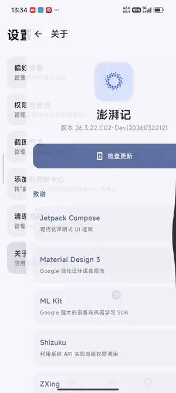
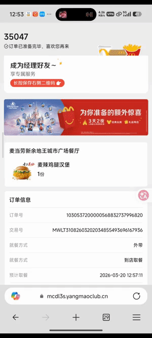
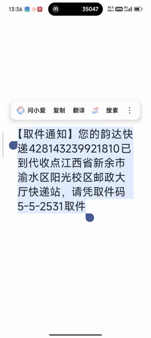
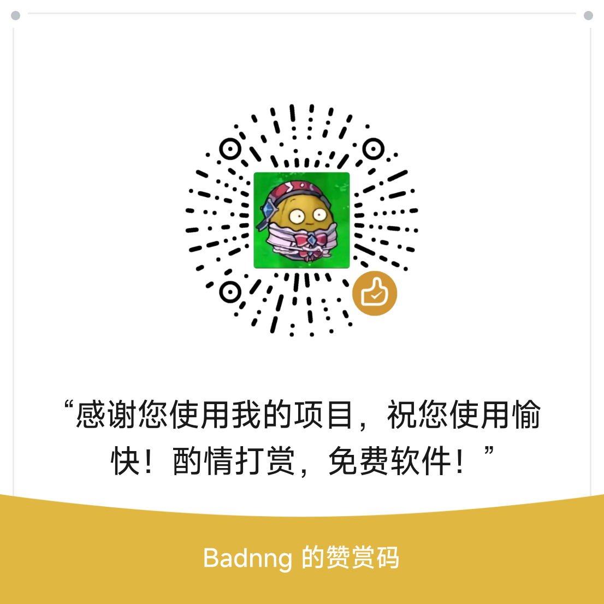

# Hyper Pick-up Code （澎湃记）🍴

**这个项目完全使用vibe coding，如果介意请勿使用**
<p align="left">
  
  
  
  
  

  <!-- 最新版本下载 -->
  <a href="https://github.com/badnng/Hyper-pick-up-code/releases/latest">
    
  </a>

  <!-- Release 版本 -->
  

  <!-- Build 状态（需要 GitHub Actions） -->
  
</p>

> 🚀 快速 · 🔒 隐私 · ⚡ 离线  
> 一个专注于 **取餐码 / 取件码识别** 的高效 Android 工具

---

## 📌 项目简介

**澎湃记** 是一款基于本地 OCR 的 Android 应用，用于快速识别并管理外卖取餐码、快递取件码等信息。

相比依赖云端识别的方案，本应用**完全本地运行**，具备：

- ⚡ 更快的识别速度  
- 🔒 更高的隐私安全  
- 📶 无网络依赖  

---

## 🌳 项目结构

```
app/src/main/
├── java/com/Badnng/moe/
│   ├── HyperNoteApp.kt                    # Application 入口
│   ├── activity/
│   │   ├── MainActivity.kt                # 主 Activity
│   │   ├── OrderQuickViewActivity.kt      # 通知点击快速查看
│   │   ├── PermissionActivity.kt          # 权限/截图触发
│   │   ├── ProcessTextActivity.kt         # 划词识别入口
│   │   └── ShareReceiverActivity.kt       # 分享接收入口
│   ├── data/
│   │   ├── db/
│   │   │   ├── OrderEntity.kt             # 订单实体
│   │   │   ├── OrderGroup.kt              # 订单组实体
│   │   │   ├── OrderDao.kt                # 订单 DAO
│   │   │   ├── OrderGroupDao.kt           # 组 DAO
│   │   │   └── OrderDatabase.kt           # Room 数据库
│   │   └── repository/
│   │       ├── OrderRepository.kt         # 订单仓库
│   │       └── OrderGroupRepository.kt    # 组仓库
│   ├── helper/
│   │   ├── BrandIconResolver.kt           # 品牌图标解析
│   │   ├── NotificationHelper.kt          # 通知构建
│   │   ├── NotificationScheduler.kt       # 定时通知调度
│   │   ├── ScreenshotHelper.kt            # 截图辅助
│   │   ├── ShizukuScreenshotHelper.kt     # Shizuku 特权截图
│   │   ├── SuperIslandHelper.kt           # 小米超级岛
│   │   ├── UpdateHelper.kt                # 应用更新
│   │   └── BackupHelper.kt                # 备份恢复
│   ├── ocr/
│   │   ├── PaddleOcrHelper.kt             # PaddleOCR ncnn 封装
│   │   └── TextRecognitionHelper.kt       # 核心识别逻辑
│   ├── receiver/
│   │   ├── SmsRecognitionReceiver.kt      # 短信广播接收
│   │   └── ScheduledNotificationReceiver.kt
│   ├── rules/
│   │   ├── RecognitionRuleEngine.kt       # 规则引擎核心
│   │   ├── RuleModels.kt                  # 规则数据模型
│   │   ├── RuleRepository.kt              # 规则仓库
│   │   └── RuleOnlineUpdater.kt           # 在线规则更新
│   ├── service/
│   │   ├── KeepAliveService.kt            # 前台保活服务
│   │   ├── ScreenCaptureService.kt        # 屏幕截图服务
│   │   ├── SmsRecognitionService.kt       # 短信识别服务
│   │   ├── CaptureTileService.kt          # 快捷设置磁贴
│   │   ├── NotificationListenerRecognitionService.kt
│   │   └── VolumeShortcutAccessibilityService.kt
│   ├── ui/
│   │   ├── AppUi.kt                       # UI 兼容层接口
│   │   ├── Md3eAppUi.kt                   # MD3E 实现
│   │   ├── MiuixAppUi.kt                  # Miuix 实现
│   │   ├── component/
│   │   │   ├── SettingsComponents.kt      # 设置组件
│   │   │   └── UpdateDialog.kt            # 更新弹窗
│   │   ├── screen/
│   │   │   ├── HomeScreen.kt              # 主页（Pager 容器）
│   │   │   ├── CaptureScreen.kt           # 识别记录页
│   │   │   ├── RulesScreen.kt             # 规则管理页
│   │   │   ├── GroupDetailScreen.kt       # 组详情页
│   │   │   ├── OrderDetailScreen.kt       # 订单详情页
│   │   │   └── settings/                  # 设置子页面
│   │   │       ├── SettingsScreen.kt      # 设置主页
│   │   │       ├── SettingsPreference.kt  # 偏好设置
│   │   │       ├── SettingsPermission.kt  # 权限管理
│   │   │       └── ...
│   │   ├── miuix/                         # Miuix UI 实现
│   │   │   ├── MiuixHomeScreen.kt
│   │   │   ├── MiuixCaptureScreen.kt
│   │   │   └── ...
│   │   └── theme/
│   │       ├── Theme.kt                   # 主题定义
│   │       ├── ColorGenerator.kt          # 种子色→色调盘生成
│   │       └── Color.kt                   # 预设色定义
│   └── viewmodel/
│       └── OrderViewModel.kt              # ViewModel
├── assets/
│   └── default_rules.json                 # 内置识别规则
└── res/
    └── ...
```

## ✨ 核心特性

### 🔍 智能识别
- 本地 OCR 引擎（无需联网）
- 自动提取取餐码 / 取件码
- 高精度文本识别

### 🔒 隐私优先
- 所有数据仅在本地处理
- 不上传任何用户信息
- 无埋点 / 无追踪

### ⚡ 多入口触发
- 📸 截图识别
- 📤 分享识别
- ✂️ 划词识别
- 🔘 快捷开关（磁贴）

### 🎨 现代 UI
- Material You 设计风格
- 自适应主题
- 简洁流畅的交互体验

---

## 📷 动图演示
<p align="center">
  
  
  
</p>

---

## ❤️ 赞助

感谢您使用我的项目，项目制作花费的时间精力很大
如果您觉得这个项目对您有帮助，欢迎赞助支持！🙏
在上学期间做的小项目，软件完全免费，如果倒卖请联系退款并举报！!
这个项目完全使用vibe coding，如果介意请勿使用，设计完全是自己的想法，自己不会实现罢了！

<p align="center">
  
  
</p>